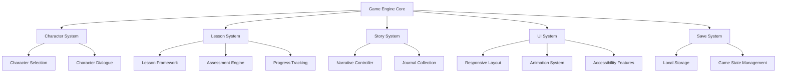

# Cat Chronicles Game Design Document

## Overview

Cat Chronicles is a web-based educational game built with modern HTML5, CSS3, and JavaScript technologies. The game features a modular architecture supporting character selection, story progression, educational lessons, and progress tracking. The design emphasizes accessibility, responsive layouts, and smooth 60fps animations while maintaining a cozy 16-bit pixel art aesthetic.

## Architecture

### High-Level System Architecture



### Technology Stack

- **Frontend Framework**: Vanilla JavaScript ES6+ with modular architecture
- **Styling**: CSS3 with CSS Grid and Flexbox for responsive layouts
- **Graphics**: CSS sprites and transforms for character animations
- **Audio**: Web Audio API for sound effects and background music
- **Storage**: LocalStorage API for save game persistence
- **Build Tools**: Modern bundler (Vite/Webpack) for asset optimization

## Components and Interfaces

### Core Game Engine

```javascript
class GameEngine {
  constructor() {
    this.currentScene = null;
    this.gameState = new GameState();
    this.audioManager = new AudioManager();
    this.inputManager = new InputManager();
  }
  
  init() { /* Initialize game systems */ }
  update(deltaTime) { /* Game loop update */ }
  render() { /* Render current scene */ }
}
```

### Character System

**Character Selection Component**
- Displays four character cards with hover effects
- Manages character sprite rendering with CSS filters for color variations
- Handles selection state and validation
- Responsive grid layout for different screen sizes

**Character Data Structure**
```javascript
const characters = {
  mango: {
    name: "Mango",
    color: "orange",
    personality: "adventurous",
    cssFilter: "hue-rotate(0deg) saturate(1.2)",
    dialogueStyle: "enthusiastic"
  },
  snickers: {
    name: "Snickers", 
    color: "purple",
    personality: "analytical",
    cssFilter: "hue-rotate(270deg) saturate(1.1)",
    dialogueStyle: "thoughtful"
  },
  // ... other characters
};
```

### Lesson System Architecture

**Lesson Framework**
```javascript
class Lesson {
  constructor(config) {
    this.phases = [
      new ContextPhase(config.context),
      new InformationPhase(config.information),
      new PracticePhase(config.practice),
      new AssessmentPhase(config.assessment),
      new RewardPhase(config.reward)
    ];
  }
  
  start() { /* Begin lesson sequence */ }
  nextPhase() { /* Progress to next phase */ }
  complete() { /* Handle lesson completion */ }
}
```

**Assessment Engine**
- Multiple choice question handler
- Interactive demonstration validator
- Progress tracking and adaptive hints
- Success/failure state management

### UI System Design

**Responsive Layout System**
- CSS Grid for main layout structure
- Flexbox for component-level layouts
- Breakpoints: Mobile (768px), Tablet (1024px), Desktop (1200px+)
- Touch-friendly 44px minimum target sizes

**Animation System**
```css
.character-card {
  transition: transform 0.3s ease, box-shadow 0.3s ease;
}

.character-card:hover {
  transform: scale(1.05);
  box-shadow: 0 8px 25px rgba(218, 165, 32, 0.3);
}

.success-animation {
  animation: celebrate 0.8s ease-out;
}

@keyframes celebrate {
  0% { transform: scale(1); }
  50% { transform: scale(1.1) rotate(5deg); }
  100% { transform: scale(1); }
}
```

## Data Models

### Game State Model
```javascript
class GameState {
  constructor() {
    this.selectedCharacter = null;
    this.currentLesson = null;
    this.completedLessons = [];
    this.journalPages = [];
    this.playerProgress = {
      totalPlayTime: 0,
      lessonsCompleted: 0,
      journalPagesFound: 0
    };
  }
}
```

### Lesson Progress Model
```javascript
class LessonProgress {
  constructor(lessonId) {
    this.lessonId = lessonId;
    this.currentPhase = 0;
    this.attempts = 0;
    this.hintsUsed = 0;
    this.startTime = Date.now();
    this.completed = false;
  }
}
```

### Journal Page Model
```javascript
class JournalPage {
  constructor(id, title, content, lessonArea) {
    this.id = id;
    this.title = title;
    this.content = content;
    this.lessonArea = lessonArea; // "hieroglyphics", "marketplace", "pyramid"
    this.discovered = false;
    this.discoveryTime = null;
  }
}
```

## Error Handling

### Graceful Degradation Strategy
- Progressive enhancement for older browsers
- Fallback sprites for unsupported CSS filters
- Alternative input methods for touch/keyboard navigation
- Offline functionality with cached assets

### Error Recovery Patterns
```javascript
class ErrorHandler {
  static handleAssetLoadError(asset) {
    console.warn(`Failed to load ${asset}, using fallback`);
    return this.getFallbackAsset(asset);
  }
  
  static handleSaveError(error) {
    this.showUserFriendlyMessage("Progress couldn't be saved, but you can continue playing!");
    return this.useTemporaryStorage();
  }
}
```

## Testing Strategy

### Unit Testing Approach
- **Character System**: Test character selection, dialogue generation, sprite rendering
- **Lesson Framework**: Test phase progression, assessment validation, progress tracking
- **UI Components**: Test responsive behavior, accessibility features, animation states
- **Save System**: Test data persistence, corruption recovery, migration

### Integration Testing
- **End-to-End Lesson Flow**: Complete lesson from start to reward phase
- **Character Journey**: Full game progression with different character choices
- **Responsive Design**: Cross-device functionality testing
- **Accessibility**: Screen reader compatibility, keyboard navigation

### Performance Testing
- **Load Time**: Initial bundle under 10MB, subsequent lessons lazy-loaded
- **Animation Performance**: Maintain 60fps during transitions and interactions
- **Memory Usage**: Efficient sprite management and garbage collection
- **Battery Impact**: Optimize for mobile device battery life

### Browser Compatibility Testing
- **Modern Browsers**: Chrome, Firefox, Safari, Edge (last 2 versions)
- **Mobile Browsers**: iOS Safari, Chrome Mobile, Samsung Internet
- **Feature Detection**: Graceful fallbacks for unsupported features
- **Performance Profiling**: Ensure smooth experience across device capabilities

## Implementation Phases

### Phase 1: Core Infrastructure
- Game engine initialization
- Basic scene management
- Asset loading system
- Local storage integration

### Phase 2: Character Selection
- Character selection UI
- Sprite rendering with CSS filters
- Character data management
- Selection validation

### Phase 3: Lesson Framework
- Lesson phase system
- Assessment engine
- Progress tracking
- Journal page collection

### Phase 4: Content Integration
- Specific lesson implementations (Hieroglyphics, Marketplace, Pyramid)
- Story dialogue system
- Audio integration
- Visual polish

### Phase 5: Accessibility & Polish
- Screen reader support
- Keyboard navigation
- High contrast mode
- Performance optimization